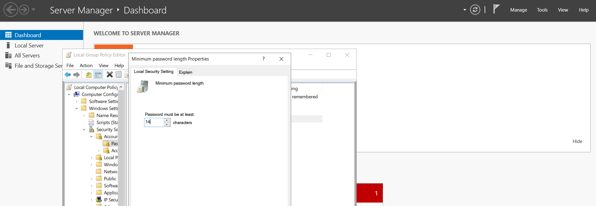
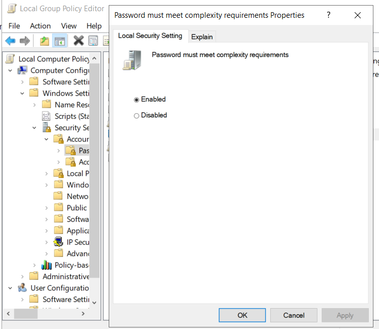
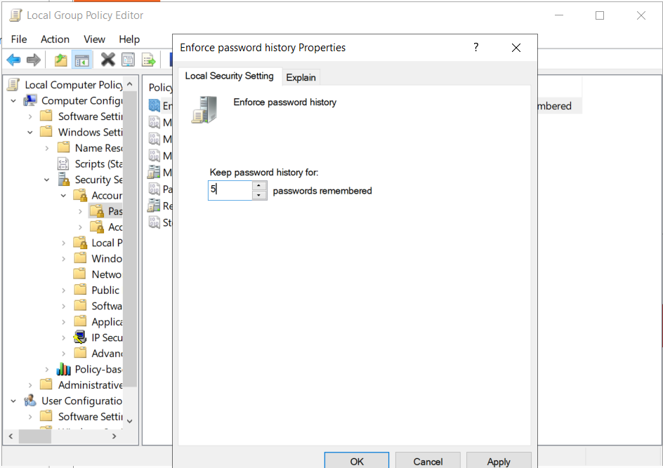
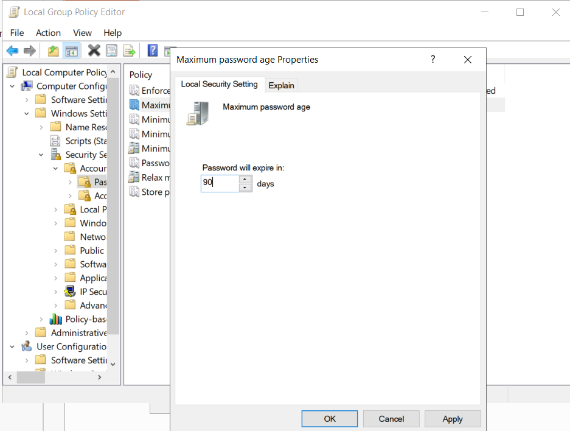
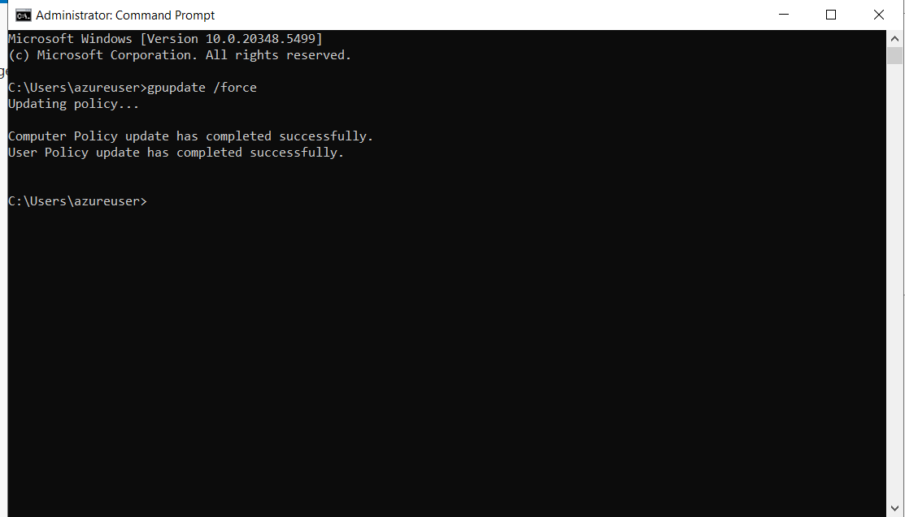
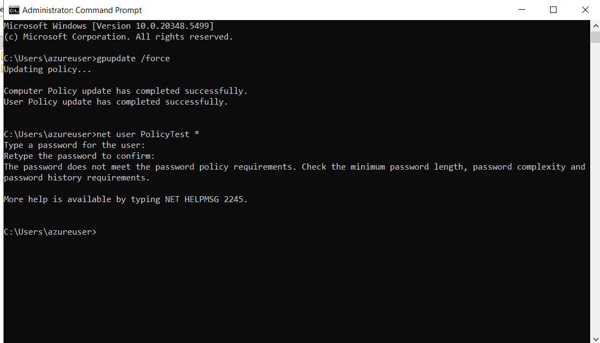
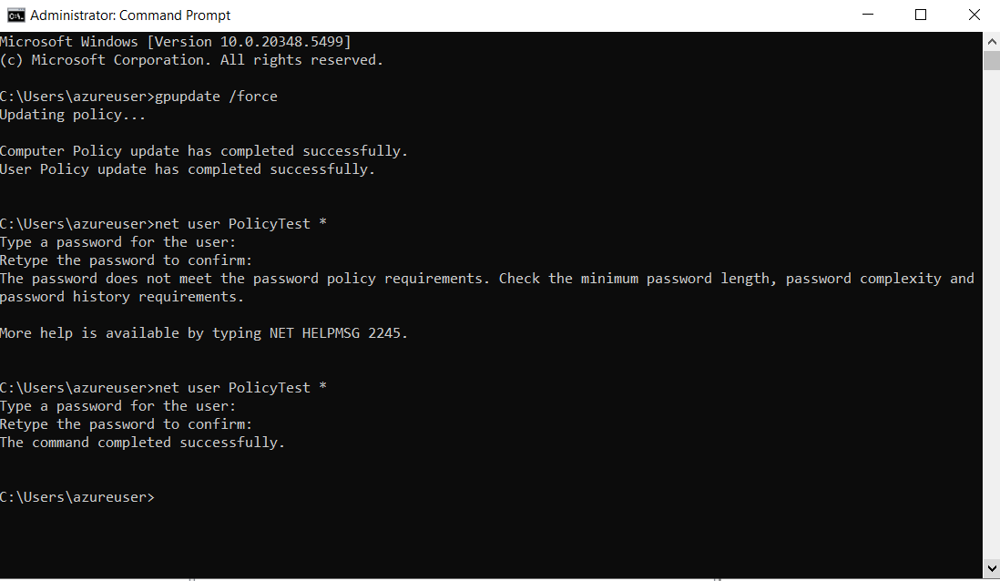

# NIST 800-53 Security Controls Lab

## Project Overview

This lab focused on implementing and validating Windows security controls using Group Policy on a Windows Server hosted in Microsoft Azure.

I configured password security requirements, applied the policy, and tested the controls using a dedicated test account. The goal was to understand how NIST 800-53 security requirements can be translated into technical system configurations and validated to confirm that the controls are functioning as intended.

The lab primarily mapped to:

- **AC-2 – Account Management**
- **IA-5 – Authenticator Management**

---

## Technologies Used

- Microsoft Azure
- Windows Server
- Local Group Policy Editor
- Windows Command Prompt
- Group Policy
- NIST SP 800-53
- Remote Desktop Protocol (RDP)

---

## Lab Objectives

The objectives of this lab were to:

- Configure stronger password requirements
- Enforce password complexity
- Prevent immediate password reuse
- Configure password expiration
- Apply updated Group Policy settings
- Test whether the password policy was actually enforced
- Map technical configurations to NIST 800-53 controls

---

## Password Policy Configuration

I navigated to:

`Computer Configuration > Windows Settings > Security Settings > Account Policies > Password Policy`

I configured the following settings:

| Security Setting | Configuration |
|---|---|
| Minimum password length | 14 characters |
| Password complexity | Enabled |
| Password history | 5 passwords remembered |
| Maximum password age | 90 days |

---

## 1. Minimum Password Length

I configured the minimum password length to require passwords containing at least **14 characters**.

Increasing password length helps make password guessing and brute-force attacks more difficult.

---

## 2. Password Complexity

I enabled:

**Password must meet complexity requirements**

This prevents users from creating overly simple passwords and requires stronger password construction.

---

## 3. Password History

I configured Windows to remember the previous **5 passwords**.

This prevents users from immediately reusing recently used passwords.

---

## 4. Maximum Password Age

I configured the maximum password age to **90 days**.

This setting controls how long a password can remain active before Windows requires it to be changed.

---

## Applying the Policy

After configuring the security settings, I opened an elevated Command Prompt and ran:

`gpupdate /force`

This forced Windows to immediately process the updated Group Policy settings.

Both the Computer Policy and User Policy updates completed successfully.

---

## Testing and Validation

After applying the policy, I tested the configuration using a dedicated test account named:

`PolicyTest`

I used the following command to attempt password changes:

`net user PolicyTest *`

Testing the policy allowed me to verify that the security controls were actually being enforced rather than simply configured.

---

## Weak Password Test

I attempted to assign a password that did not meet the configured password policy requirements.

Windows rejected the password and returned a message stating that the password did not meet the password policy requirements.

This confirmed that the policy was functioning correctly.

---

## Strong Password Test

I then repeated the test using a password that satisfied the configured requirements.

Windows accepted the password and returned:

`The command completed successfully.`

This confirmed that compliant passwords were accepted while non-compliant passwords were rejected.

---

## NIST 800-53 Control Mapping

### AC-2 – Account Management

AC-2 focuses on managing and protecting system accounts.

The password policy implemented in this lab supports account security by enforcing authentication requirements for user accounts.

### IA-5 – Authenticator Management

IA-5 focuses on managing authenticators such as passwords and other credentials.

The controls implemented in this lab support authenticator management by enforcing password requirements, limiting password reuse, and managing password expiration.

---

## Validation Results

The lab demonstrated the complete security control implementation process:

**Configure → Apply → Test → Validate**

Results:

- Minimum password length was successfully configured
- Password complexity was enabled
- Password history was enforced
- Maximum password age was configured
- Group Policy was successfully updated
- Weak passwords were rejected
- Compliant passwords were accepted
- The security controls functioned as expected

---

## Key Takeaways

This lab helped me understand how security framework requirements can be translated into real technical configurations.

Instead of only reviewing NIST controls from a policy perspective, I implemented the controls directly in Windows and validated that they were working as intended.

I gained hands-on experience with:

- Windows Group Policy
- Password policy configuration
- Authentication security
- Security control implementation
- Security control validation
- Windows command-line administration
- Microsoft Azure Windows Server administration
- NIST 800-53 control mapping
- GRC control implementation

One of the most important lessons from this lab was that security controls should not simply be configured and assumed to work. They should be **tested, validated, and documented with evidence**.
